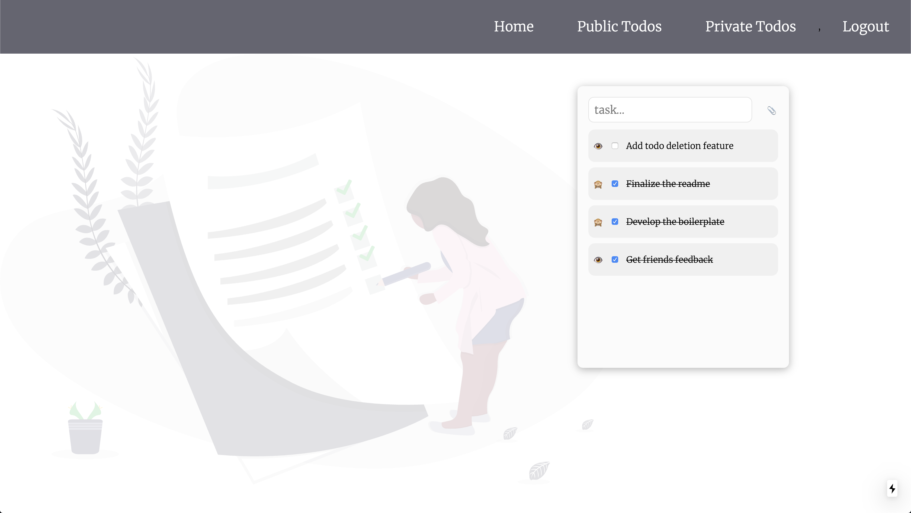

# Fullstack React & GraphQL - Next JS and Hasura Starter Kit



A boilerplate (a todos app) for a fullstack React and GraphQL application using Next JS and Hasura. It provides a minimal JWT setup for authentication and authorization. It utilizes Next JS's serverless capabilities by exposing `/api/login` and `/api/register` - Both yeild a short-lived JWT access token that gets used by the Next JS app while communicating with Hasura backend to perform the needed authorization.

## Technologies and Practices

Below is the list of the open source technologies and practices included in this starter:

- [Next JS](https://nextjs.org/): Provides the flexibility in choosing the rendering approach (CSR/SSR/SSG) for each page. It also provides `api` routes to act as a minimal Express server.
- [Hasura](https://hasura.io/): GraphQL engine that connects your databases & other service with your app by automatically generating a GraphQL backend.
- [PostgreSQL](https://www.postgresql.org/): Powerful open source object-relational database system that uses and extends the SQL language.
- [JWT](https://jwt.io/): Industry standard for securly representing claims between parites. This project's implementation includes a short-lived access token that is stored in memory (and in a secured http-only cookies for Next JS SSR), and a long-lived refresh token that is stored in an http-only secured cookie that is only scoped to the `/api/refresh-token` API route. This approach should ensure highest security against the common XSS and CSRF attacks. The implementation is not compromising the UX thanks to implementing a mechanism to silently refresh the expired access token.
- [React Query](https://github.com/tannerlinsley/react-query): One of the best data state management tools in React. It is a transport/protocol/backend agnostic data fetching tool (REST, GraphQL, promises, whatever!) that provides caching, refetching, deduping, and many other amazing features.
- [Axios](https://github.com/axios/axios): One of the most flexible HTTP clients that works in the browser and the server. It's used as the REST API client and also as the GraphQL client in this project for maximum utilization.

## Getting Started

### 0. Prerequisits

- [NodeJS](https://nodejs.org/en/)
- [Docker](https://www.docker.com/)
- [Docker Compose](https://docs.docker.com/compose/)
- [Hasura CLI](https://hasura.io/docs/1.0/graphql/manual/hasura-cli/index.html)

### 1. Clone this repo

```sh
$ git clone https://github.com/fghurayri/nextjs-hasura-starter.git
```

### 2. Running the backend locally (Hasura)

```sh
$ cd api
$ docker-compose up -d
$ hasura migrate apply
$ hasura metadata apply
$ hasura console
```

### 3. Running the frontend locally (Next JS)

```sh
$ cd web
$ yarn && yarn dev
```

## Note

It is advised to not keep the secrets checked in your repository. I've kept them checked here only to minimize the friction in getting started. Please read the official docs for Next JS and Hasura to learn more about how to properly change/add the secrets before going to production!

Happy Hacking! 🚀
